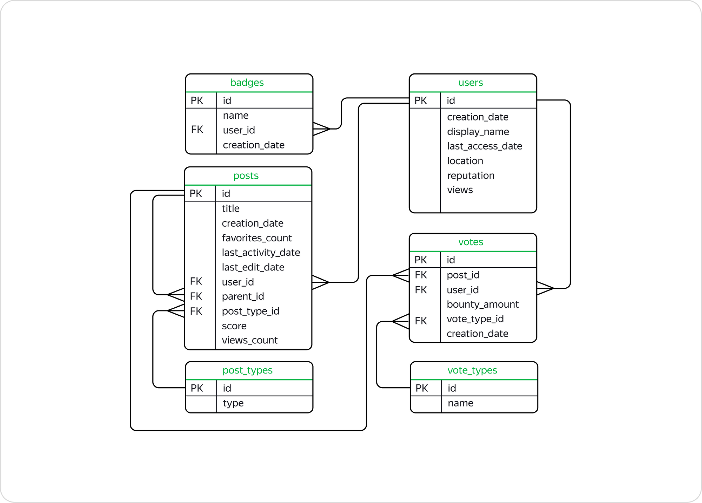

#  Исследование данных о постах в социальной сети StackOverflow
# Описание данных

## Задача

Произвести различные выгрузки данных о постах в социальной сети с помощью SQL

### Общие выводы

В проекте работал с базой данных [StackOverflow](https://stackoverflow.com/) — сервиса вопросов и ответов о программировании. StackOverflow похож на социальную сеть — пользователи сервиса задают вопросы, отвечают на посты, оставляют комментарии и ставят оценки другим ответам.
Работа проходила с версией базы, где хранятся данные о постах за 2008 год, в таблицах  найходиласт информация и о более поздних оценках, которые эти посты получили.

## Используемые библиотеки
*DBeaver*, *SQL*, *PostgreSQL*, *numpy*

**Полезные ссылки**
 - [Курс MySQL](https://stepik.org/course/63054/syllabus)
 - [Упражнения SQL](https://sql-ex.ru/)
 - [Подборка курсов по SQL](https://uproger.com/sql-45-besplatnyh-kursov-trenazherov-testov/)
 - [RoadMap от Yandex](https://yandex.ru/yaintern/int_02)

